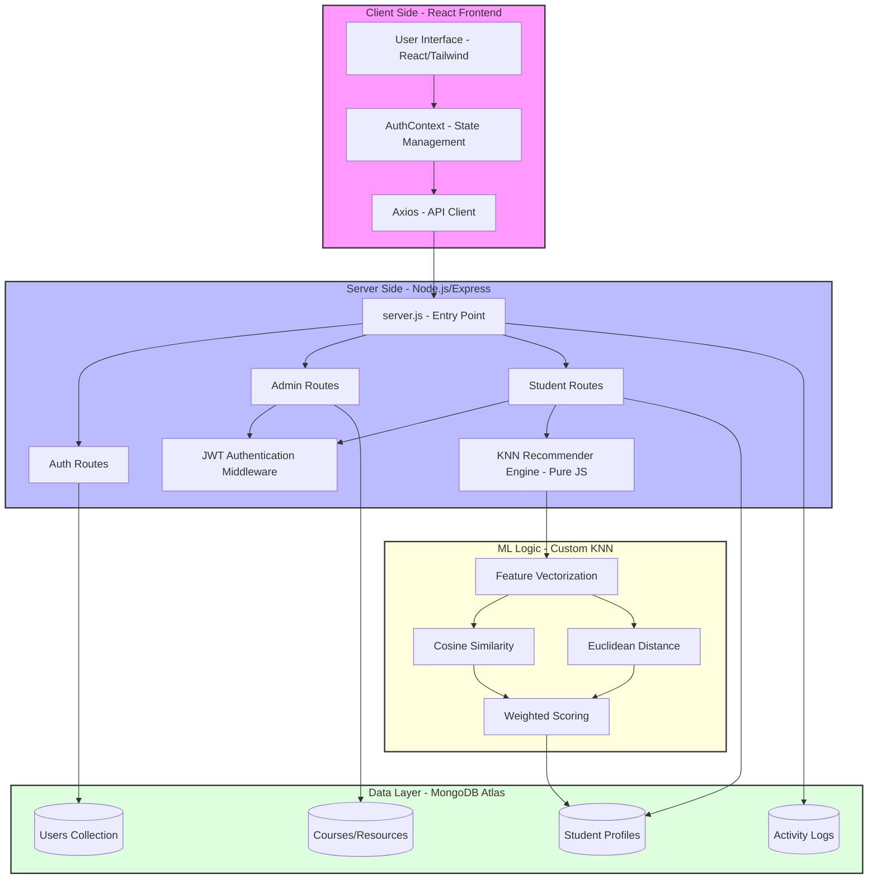
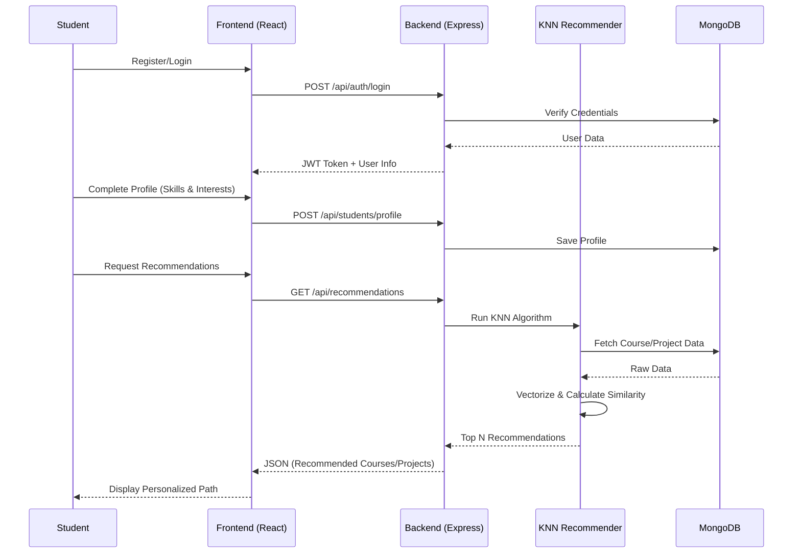

# 🏗️ Final System Architecture Diagram

This diagram represents the final state of the SkillSphere platform, including the Frontend, Backend, Database, and Recommendation Engine.

---

# 🚀 Proof of Concept (POC) Flow

The POC demonstrates the end-to-end journey of a student from profile creation to receiving personalized career recommendations.

